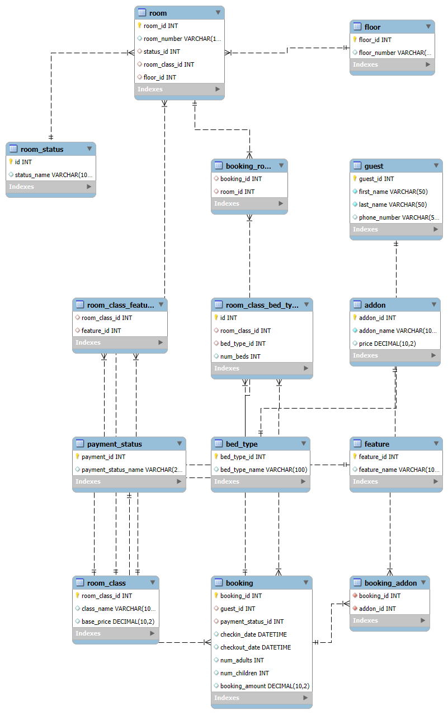

# 🏨 Hotel Management System Database

## 📌 Project Description
This is a complete relational database management system (DBMS) designed for a **Hotel Management System**.  
It handles guests, bookings, rooms, payments, addons, and room features with proper relationships.

## 📂 What’s Included
- ✅ `HotelDB.sql` — SQL script to create all tables with constraints and relationships.
- ✅ `hotel_erd.png` — Entity Relationship Diagram (ERD) illustrating the database structure.

## ⚙️ How to Run / Setup
1. Open **MySQL Workbench**.
2. Create a new SQL tab.
3. Open or paste the contents of `HotelDB.sql`.
4. Execute the script (⚡ button).
5. The database `hotel` and all tables will be created.

## 📊 ERD

## ✨ Features
- Tables with **Primary Keys**, **Foreign Keys**, `NOT NULL`, `AUTO_INCREMENT`, and `CHECK` constraints.
- Relationships: **1‑to‑1**, **1‑to‑many**, and **many‑to‑many** implemented via junction tables.

## 📌 Author
Created by **Wessley James** for Week 8 Assignment.
